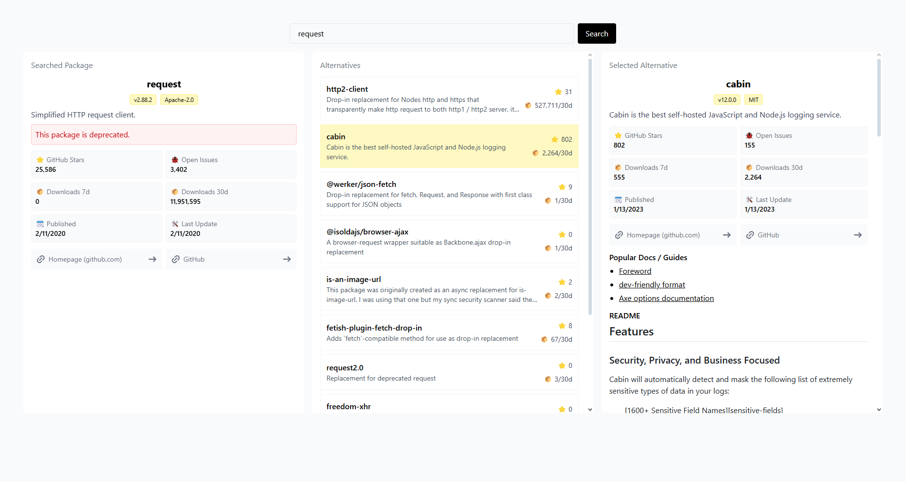

# Package Alternatives Explorer

A React + TypeScript web app to **search for NPM packages** (or a “job” like *query builder*, *http client*, etc.), and explore **alternative libraries**.

It fetches metadata like downloads, GitHub stars, publish dates, license info, community docs so you can compare options quickly.

## Contributing

1. Fork the repo
2. Create a feature branch
3. Commit changes
4. Push branch
5. Open a Pull Request
